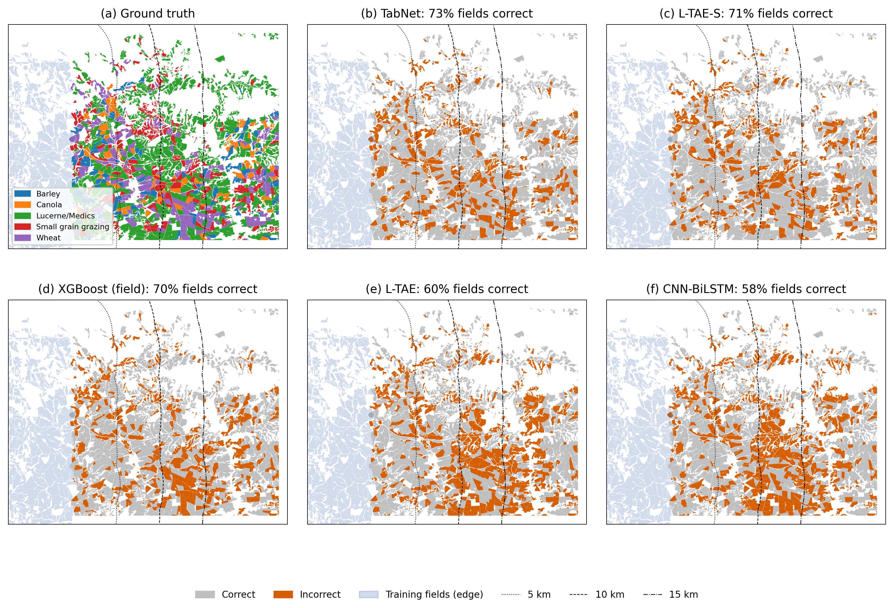
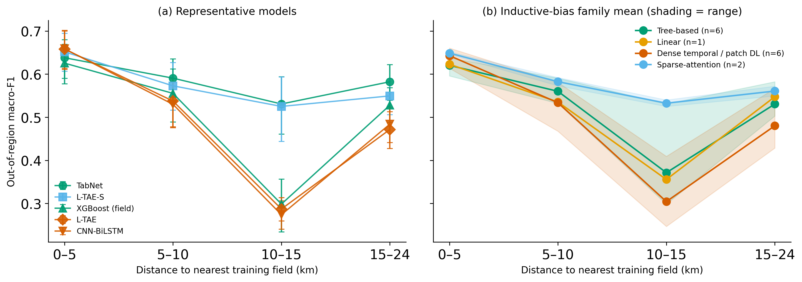

# SI candidate: spatial robustness within the holdout tile

> **STATUS (2026-10-07): maps adopted as Supplement Sec. S-E, Fig. S7 (option 1). The distance-band tables and figure below are NOT included and are kept for reference only.** Original note: Author to decide before submission whether to add this as a supplement section (and as the response to R2-Q4 / R2-Q7). The main-text acknowledgement sentence in Limitations is currently commented out.

Addresses reviewer R2-Q4 (maps of the classification results and a spatial reading of accuracy) and the distance part of R2-Q7 (transfer distance).

Code and outputs: `experiments/distance_decay/spatial_robustness.py`, which reads `out_of_sample/` and writes only to `experiments/distance_decay/{results,figures}/`. A first-pass version is `distance_decay.py`.

## Method

For each of the 2,417 holdout fields, we take the distance from the field centroid to the nearest training-region field (UTM). Fields are grouped into four distance bands (0 to 5, 5 to 10, 10 to 15, and 15 to 24 km), and every Table 1 model is scored per band. Macro-F1 is reported with a field-bootstrap 95% CI (B = 2,000). We also fit a class-adjusted logit of per-field correctness on distance, with crop-class fixed effects. Family means use the inductive-bias families of Fig. 4.

## Figures

**Fig. S-x (a).** Ground-truth crops and correct/incorrect fields for five models, with 5, 10 and 15 km contours from the training fields.

**Fig. S-y.** Macro-F1 by distance band: (a) representative models with 95% CIs; (b) inductive-bias family means, with shading for the min–max range.

## Tables

**Table S-x. Fields per class in each distance band.**

| Band (km) | Barley | Canola | Lucerne/Medics | Small grain grazing | Wheat | Fields |
|---|---|---|---|---|---|---|
| 0–5 | 78 | 37 | 239 | 73 | 94 | 521 |
| 5–10 | 39 | 25 | 246 | 153 | 67 | 530 |
| 10–15 | 14 | 16 | 362 | 108 | 59 | 559 |
| 15–24 | 61 | 60 | 513 | 93 | 80 | 807 |

**Table S-y. Out-of-region macro-F1 by distance band, all models (Table 1 order).** "Range" is the best band minus the worst band. The worst band is 10–15 km for every model. Per-band CIs are in `results/f1_by_distance_all_models.csv`.

| Model | 0–5 | 5–10 | 10–15 | 15–24 | Range |
|---|---|---|---|---|---|
| TabNet (pixel) | 0.64 | 0.59 | 0.53 | 0.58 | 0.11 |
| L-TAE-S (field) | 0.65 | 0.59 | 0.54 | 0.57 | 0.11 |
| L-TAE-S (pixel) | 0.65 | 0.57 | 0.53 | 0.55 | 0.13 |
| L-TAE (field) | 0.65 | 0.57 | 0.50 | 0.58 | 0.15 |
| Transformer (pixel) | 0.65 | 0.53 | 0.41 | 0.57 | 0.24 |
| TempCNN (pixel) | 0.66 | 0.58 | 0.33 | 0.49 | 0.34 |
| XGBoost (field) | 0.63 | 0.56 | 0.30 | 0.53 | 0.33 |
| LightGBM (pixel) | 0.62 | 0.57 | 0.34 | 0.53 | 0.28 |
| Logistic Regression (pixel) | 0.62 | 0.54 | 0.36 | 0.55 | 0.27 |
| LightGBM (field) | 0.63 | 0.55 | 0.34 | 0.50 | 0.29 |
| Voting (pixel) | 0.61 | 0.55 | 0.42 | 0.52 | 0.19 |
| Random Forest (pixel) | 0.61 | 0.56 | 0.37 | 0.51 | 0.25 |
| XGBoost (pixel) | 0.60 | 0.53 | 0.36 | 0.53 | 0.24 |
| L-TAE (pixel) | 0.66 | 0.54 | 0.29 | 0.47 | 0.37 |
| TempCNN (field) | 0.64 | 0.57 | 0.25 | 0.46 | 0.40 |
| Stacking (field) | 0.63 | 0.57 | 0.32 | 0.46 | 0.31 |
| CNN-BiLSTM (pixel) | 0.66 | 0.53 | 0.27 | 0.48 | 0.39 |
| CNN-BiLSTM (field) | 0.62 | 0.55 | 0.28 | 0.46 | 0.33 |
| 3D CNN (patch) | 0.61 | 0.56 | 0.28 | 0.44 | 0.33 |
| SMOTE Stacked (field) | 0.57 | 0.49 | 0.27 | 0.49 | 0.30 |
| Multi-Channel 2D CNN (patch) | 0.62 | 0.47 | 0.25 | 0.43 | 0.37 |
| TabNet raw field-avg (field) | 0.50 | 0.44 | 0.26 | 0.42 | 0.24 |
| TabNet xr_fresh (field) | 0.46 | 0.32 | 0.17 | 0.35 | 0.30 |

**Table S-z. Family means (Fig. 4 families).**

| Family | n | 0–5 | 5–10 | 10–15 | 15–24 | Mean range |
|---|---|---|---|---|---|---|
| Sparse-attention (L-TAE-S) | 2 | 0.65 | 0.58 | 0.53 | 0.56 | 0.12 |
| Tree-based (incl. TabNet pixel) | 6 | 0.62 | 0.56 | 0.37 | 0.53 | 0.25 |
| Linear | 1 | 0.62 | 0.54 | 0.36 | 0.55 | 0.27 |
| Dense temporal / patch DL | 6 | 0.64 | 0.53 | 0.30 | 0.48 | 0.34 |

## Findings

1. **No monotone distance decay within 24 km.** Every model does best in the 0–5 km band and worst in the 10–15 km band, then partly recovers at 15–24 km. After adjusting for crop class, distance has a *positive* or null association with per-field correctness for every model (`results/distance_effect_all_models.csv`). Distance itself is therefore not the driver. The 10–15 km band is a contiguous strip of the tile, and the maps show that the errors concentrate in a south-central block, which points to local conditions.
2. **The hard zone separates models sharply.** Near the training tiles all models are within about 0.06 of each other (0.60 to 0.66, excluding the two weak field TabNets). In the 10–15 km band, TabNet (pixel), both L-TAE-S variants and field-level L-TAE hold 0.50 to 0.54. The dense pixel nets, the tree and linear learners, and the ensembles fall to 0.25 to 0.42. The sparse-attention family has the smallest mean range across bands (0.12, against 0.25 for trees and 0.34 for dense networks).
3. **This is not small-sample noise.** In the 10–15 km band, L-TAE scores 0.61 F1 on lucerne/medics (362 fields) against TabNet's 0.89, and 0.00 on canola (16 fields) and barley (14 fields).
4. **Relation to the main thesis.** The result supports the claim that the sparse feature-selection models are the most spatially stable. It also qualifies it: XGBoost, LightGBM and random forest (tree-based, sparse splits) collapse in the hard zone almost as much as the dense networks, so within-tile robustness belongs to TabNet and L-TAE-S, and to field aggregation for L-TAE, not to tree models in general.

## Caveats

- Distance bands are confounded with location and crop mix: lucerne/medics makes up 46% of the 0–5 km band and 64–65% beyond 10 km, and the 10–15 km band has few barley (14) and canola (16) fields, which makes macro-F1 there sensitive.
- One tile and one season. This shows within-tile heterogeneity; it does not measure transfer over larger distances.

## Draft SI text (LaTeX-ready prose, no em dashes)

> **Spatial distribution of holdout errors.** To examine where models fail within the holdout tile, we computed the distance from each holdout field to the nearest training field (0 to 24 km, median 11 km) and scored every model in four distance bands (Table S-y, Fig. S-y). Accuracy does not decline monotonically with distance: all models score highest within 5 km of the training region and lowest in the 10 to 15 km band, and after adjusting for crop class, distance is not negatively associated with per-field correctness. Errors instead concentrate in a contiguous south-central zone of the tile (Fig. S-x). Near the training tiles all models perform similarly (macro-F1 0.60 to 0.66), but in the hard zone TabNet, both L-TAE-S variants, and field-level L-TAE hold 0.50 to 0.54, while the dense pixel networks, tree and linear learners, and ensembles fall to 0.25 to 0.42. The sparse-attention models therefore show the smallest variation across the tile (mean band range 0.12, against 0.25 for tree-based and 0.34 for dense models). Because distance bands are confounded with location and crop mix, and the hard zone contains few barley and canola fields, we interpret this as within-tile spatial heterogeneity rather than a distance-decay effect.

## Draft response-letter text

- **If included (R2-Q4):** We added maps of correct and incorrect holdout fields for five representative models and an analysis of accuracy by distance from the training region (Supplement Sec. S-E, Figs. S-x, S-y, Table S-y). Errors are not uniform: all models struggle most in a contiguous zone 10 to 15 km from the training tiles, where the sparse feature-selection models (TabNet, L-TAE-S) retain macro-F1 above 0.50 while dense temporal networks and tree ensembles fall to 0.25 to 0.42. Accuracy does not decline monotonically with distance, so we interpret this as local heterogeneity within the tile.
- **If not included (R2-Q4):** We thank the reviewer for this suggestion. Our evaluation is at the tile level, and we now acknowledge in the Limitations that we do not analyze the spatial distribution of errors within the holdout tile (Sec. 5.5; requires restoring the commented-out sentence). [Optionally: a preliminary analysis showed errors concentrated in part of the tile, which we will pursue in future work with multi-tile benchmarks.]
